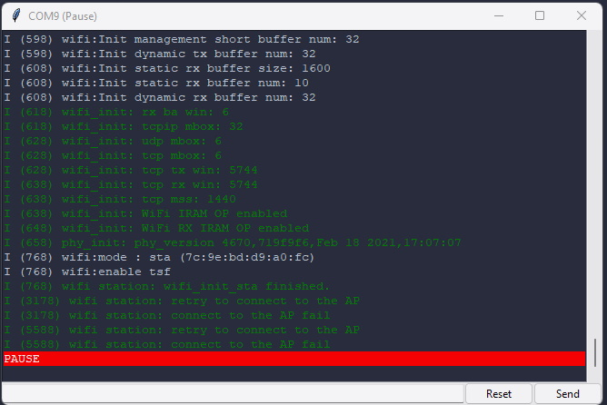

# SerialGenie

SerialGenie is a serial monitor mostly focus on simplicity and advanced functionalities 
It is currently in pre-alpha so expected weird behaviour.   

For now only available on Windows (sorry :-( )   
Check out the github workflow, to learn how to automatically generate windows binairies!

# [Download](https://github.com/usini/serialGenie/releases)

# Features

* Always on top
* AutoSkip COM1
* Autodetect first available ports
* Auto reconnection
* Tag when line is repeat (as in Chrome Developer tools)
* Pause when focus lost (to avoid uploading issue)
* Colored line (for esp-idf)
* Detect esp32 boot message and don't display it
* Reset button

# Future features

* MQTT client 
* Disable autopause
* More intelligent autoskip (to detect Bluetooth serial or other serial device we don't want)
* Baudrate / NewLine settings
* Proper installer / update
* Save footprint of serial device to detect if it is the same (serialnumber/type etc...)
* Rename device
* Multiples monitor for managing multiples board at the same time
* Display information taken for esp32 boot (What makes it boot for ex.)
* Exception decoder 
* And many more stuff
* Graphing capabilities
* Detect esp-idf log to display it on pretty gui
* Detect most common firmware and add customs commands

